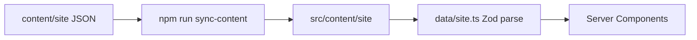

# Portfolio architecture

High-level map of `portfolio-personal` — how content, routes, and deploy fit together.

## Repository layout

```text
portfolio-personal/
├── content/site/*.json     # Canonical site copy (edit here)
├── content/_archive/       # Retired Gatsby markdown + unused JSON
├── docs/                   # Roadmap, architecture, CMS notes
├── netlify.toml            # Deploy: next-app + sync-content + build
└── next-app/               # Next.js 16 App Router application
    ├── src/app/            # Routes
    ├── src/components/     # UI + sections
    ├── src/content/site/   # Synced JSON (generated from content/site)
    ├── src/data/site.ts    # Zod-validated content barrel
    └── scripts/sync-content.mjs
```

## Content flow



- **Source of truth:** `content/site/*.json` at repo root
- **Sync:** `npm run sync-content` copies into `next-app/src/content/site/`
- **Validation:** `src/lib/content-schemas.ts` (Zod) at import time in `src/data/site.ts`
- **CI gate:** `npm run verify-content` fails if copies drift

Root `npm run build` runs sync before the Next production build.

## Routes

| Route                                             | Type      | Data                                                              |
| ------------------------------------------------- | --------- | ----------------------------------------------------------------- |
| `/`                                               | Static    | `hero`, `jobs`, `about`, `featuredProjects`, `writing`, `contact` |
| `/writing`                                        | Static    | `writing.json` topics                                             |
| `/projects/[slug]`                                | SSG       | `featured-projects.json` case studies                             |
| `/pensieve`, `/pensieve/*`                        | Redirect  | → `/writing` (legacy URLs)                                        |
| `/manifest.webmanifest`                           | Generated | `app/manifest.ts`                                                 |
| `/sitemap.xml`, `/robots.txt`, `/opengraph-image` | Generated | `lib/site.ts`                                                     |

## Homepage composition

| Section      | Rendering  | Notes                                      |
| ------------ | ---------- | ------------------------------------------ |
| Hero         | **Server** | Product visual tabs + motion (client leaf) |
| Experience   | **Server** | Compact timeline + skill pillars           |
| Work         | **Server** | Bento product gallery + card previews      |
| Projects     | **Server** | Full `projects.json` catalog (`#projects`) |
| Craft        | **Server** | “What I optimize for” pillars              |
| Notes teaser | **Server** | Links to `/writing`                        |
| Contact      | **Server** | Email + availability + socials             |

Shell (header, footer, scroll progress) stays client for nav interactivity. Footer GitHub stats are fetched on the server with 1h revalidate.

## Security & analytics

- Security headers in `next.config.ts` (CSP, HSTS, frame deny, nosniff, referrer, permissions)
- Usage analytics (Vercel Analytics, and GA4 when `NEXT_PUBLIC_GA_MEASUREMENT_ID` is set) load only after the consent banner is accepted

## Deploy

Netlify (`netlify.toml`):

```bash
cd next-app && npm ci && npm run sync-content && npm run build
```

GitHub Actions (`.github/workflows/ci.yml`): verify-content → lint → typecheck → sync + build.

## Related docs

- [improvement-checklist.md](./improvement-checklist.md) — polish progress and next work
- [cms-publishing.md](./cms-publishing.md) — CMS → portfolio JSON contract (portfolio side)
- [project-roadmap.md](./project-roadmap.md) — product/project planning
- [upgrade-checklist.md](./upgrade-checklist.md) — stack + sync quick reference
